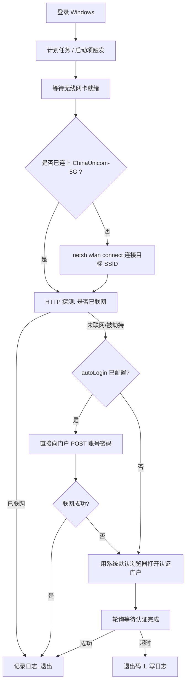

# 联通校园网自动连接（开机自启 + 默认浏览器认证）

面向 Windows 10/11：**开机登录后自动连上中国联通校园网 Wi-Fi（默认 `ChinaUnicom-5G`），
用系统默认浏览器打开认证门户；可选做到完全零点击自动登录。**

> 先说清楚一件事：**浏览器不能自己连 Wi-Fi**，这是操作系统的活。
> 所以真正的分工是 —— Windows 负责“连上无线”，浏览器负责“网页认证”。
> 本项目把这个链路全自动串起来。



---

## 目录结构

```text
unicom-autoconnect/
├── src/
│   ├── CampusNet.psm1           核心模块：无线连接 / 联网探测 / 门户发现 / 打开浏览器 / 表单登录
│   └── Connect-CampusNet.ps1    主入口（计划任务实际执行的就是它）
├── config/
│   ├── config.example.json      带注释的配置模板
│   └── config.json              你实际使用的配置（已按本机初始化）
├── scripts/
│   ├── install.ps1              安装开机自启（计划任务 / 启动文件夹）
│   ├── uninstall.ps1            卸载
│   ├── status.ps1               一键诊断
│   ├── prepare-wifi.ps1         无线配置检查 / 导入 / 自动连接设置
│   ├── capture-portal.ps1       抓包助手：自动解析门户登录表单，生成 autoLogin 配置
│   ├── run-now.cmd              双击即手动跑一次
│   ├── capture-portal.cmd       双击即运行抓包助手
│   └── status.cmd               双击即看诊断
├── tests/
│   └── Test-CampusNet.ps1       离线自检（本地模拟门户，40 项断言，不联网不改系统）
├── extension/                   可选：Chromium 扩展，在浏览器里自动填表登录
├── tools/
│   └── Normalize-Encoding.ps1   开发用：统一源码编码（.ps1 加 UTF-8 BOM）+ 语法检查
└── logs/                        运行日志与状态（自动生成，已 gitignore）
```

## 联通校园网门户信息（需在联通网络下实测确认）

切换到中国联通校园网后，**门户地址、表单字段、提交地址因学校而异，必须在“未认证”状态下双击
`scripts\capture-portal.cmd`（或执行 `capture-portal.ps1 -Write`）实测抓取**，抓包助手会自动把结果
写进 `config.json` 的 `autoLogin` 段。联通公共 WLAN 门户多与 `wlan.10010.com` 相关，校园网以学校实际部署为准。

下表右列是本项目**原移动网络的实测记录，仅作对照，不能照搬到联通网络**：

| 项目 | 联通网络（待实测） / 原移动网络记录（对照） |
|---|---|
| 目标 SSID | 联通默认按 `ChinaUnicom-5G` / `ChinaUnicom` 连接，以 `netsh wlan show interfaces` 实际看到的名称为准 |
| 门户发现方式 | 探测被 **302 重定向** 到联通认证门户；原移动网络为 `http://wlan.jsyd139.com/?ssid=CMCC-YZLAN&wlanacname=...&wlanuserip=...` |
| 门户类型 | 联通校园网常见 Dr.COM / 深澜（Srun）/ 锐捷等认证系统；原移动网络为 cmcccs / 随e行，首屏是 frameset，登录表单在子框架 `/style/default_lan/index.jsp?paramStr=...` |
| 登录表单字段 | 以抓包结果为准；原移动网络为 `paramStr`（一次性令牌）、`UserType`、`province`、`pwdType`、`serviceType`、`UserName`、`PassWord` |
| 真实提交地址 | 以抓包结果为准；原移动网络为 `/authServlet`（表单 `action=""`，地址写在 `main_cm.js` 的 `staticLoginForLan()` 里） |
| 密码是否加密 / 验证码 | 以抓包结果为准；原移动网络为**明文提交、无验证码** |
| 已认证状态下的门户 | 已认证后通常只返回提示页、**登录表单不存在**（所以抓包必须在“未认证”状态下做）；原移动网络返回 `errorpage/showNatFail_cmjs.jsp` |

链路验证方式不变：开机自启 → 连 Wi-Fi → 发现门户 → 弹默认浏览器 → 认证成功 → 脚本自动退出（`LastResult = 0x0`）。

## 三分钟上手

> **本机当前状态**：开机自启的**计划任务 `Unicom-AutoConnect` 已经装好**（登录后延迟 20 秒运行），
> 并且已经实跑验证通过（`LastResult = 0x0`）。剩下的只是“登录方式”：
> 默认是弹默认浏览器（方式 A），要零点击就去配 `autoLogin`（方式 B）。

1. **先跑一次诊断**（双击）→ `scripts\status.cmd`
   确认：无线网卡可用、目标 SSID 正确、配置文件存在、当前是否已联网。

2. **手动跑一次完整流程**（双击）→ `scripts\run-now.cmd`
   如果当前没联网，此时应该会自动连 Wi-Fi 并弹出浏览器打开认证页。

3. **装开机自启**（PowerShell 里执行）：

```powershell
cd G:\dsh\unicom-autoconnect
powershell -NoProfile -ExecutionPolicy Bypass -File .\scripts\install.ps1
```

   想先看看会做什么、不动系统：

```powershell
powershell -NoProfile -ExecutionPolicy Bypass -File .\scripts\install.ps1 -DryRun
```

   不需要管理员权限的替代方案（在“启动”文件夹放快捷方式）：

```powershell
powershell -NoProfile -ExecutionPolicy Bypass -File .\scripts\install.ps1 -Mode StartupFolder
```

卸载：

```powershell
powershell -NoProfile -ExecutionPolicy Bypass -File .\scripts\uninstall.ps1
```

## 三种“自动登录”方式，按需选

| 方式 | 配置 | 效果 | 适用 |
|---|---|---|---|
| A. 开浏览器（默认，已开） | 无需配置 | 自动弹出默认浏览器到认证页，你点一下登录 | 门户有验证码 / 需要选运营商 / 不想存密码 |
| B. 直接 POST 登录（零点击） | 配置 `autoLogin` | 后台直接提交账号密码，**根本不弹浏览器** | 普通“账号+密码”表单门户 |
| C. 浏览器扩展自动填表 | 装 `extension/` + 填账号 | 浏览器一打开就自动填好并点登录 | 只想让浏览器自己搞定，又不想在配置里写密码 |

三种可以叠加：先试 B（成功就完全不打扰），失败自动回落到 A，A 打开的门户页由 C 自动填表。

### 方式 B：两种模式

| 模式 | 适用 | 原理 |
|---|---|---|
| `portal-form`（推荐） | 表单带一次性令牌的门户（联通校园网门户的 `paramStr` 就是典型） | **每次登录前先抓一遍门户登录页**，拿到当次的新令牌，和账号密码一起提交 |
| `static` | 提交地址和字段都固定的门户 | 按配置里的 `loginUrl` + `form` 直接提交 |

> `paramStr` 这类令牌是一次性的，写死在配置里下次必然失效 —— 所以凡是带令牌的门户，
> 都要用 `portal-form` 模式让脚本每次现抓。

抓包助手会自己判断并生成配置（当前处于“未认证”状态时，双击 `scripts\capture-portal.cmd`，结果自动留在 `logs\capture-last.txt`）。
它会：找门户 → 跟进 frameset 子框架 → 解析所有字段 → **顺带扫 JS 找出写在脚本里的真实提交地址**（很多门户的表单 `action=""`，地址藏在 `forms[0].action = "/authServlet"` 这种代码里）。

```powershell
powershell -ExecutionPolicy Bypass -File .\scripts\capture-portal.ps1 -Write
# 已经能上网、看不到门户时，可以手动指定地址：
powershell -ExecutionPolicy Bypass -File .\scripts\capture-portal.ps1 -Url http://10.0.0.1/portal -Write
```

填完之后，只要在 `config.json` 里补上账号密码，把 `enabled` 改成 `true`：

```json
"autoLogin": {
  "enabled": true,
  "mode": "portal-form",
  "submitUrl": "/authServlet",
  "username": "你的账号",
  "password": "你的密码",
  "usernameField": "UserName",
  "passwordField": "PassWord"
}
```

> 登录成不成功**不看返回页面**，而是看之后能不能真的打开网页（复用 probes 探测），所以不怕门户返回的 HTML 千奇百怪。

## 配置说明（`config/config.json`）

| 字段 | 含义 | 备注 |
|---|---|---|
| `ssid` | 目标无线名，按优先级排列 | 默认 `["ChinaUnicom-5G","ChinaUnicom"]`，5G 信号弱自动回落；**务必改成学校实际的 SSID** |
| `profileName` | Windows 无线配置文件名 | 留空 = 取 ssid 第一项 |
| `interfaceName` | 无线网卡名（如 `WLAN`） | 留空让 netsh 自动选 |
| `connectTimeoutSeconds` | 单次连接 SSID 的超时 | 默认 45 |
| `overallTimeoutMinutes` | 整轮重试的总时长 | 默认 15 |
| `retryIntervalSeconds` | 每轮间隔 | 默认 5 |
| `browser.url` | 手工指定门户地址 | 留空自动探测，**推荐留空** |
| `browser.fallbackUrl` | 探测不到门户时的兜底地址 | 打开它会被运营商劫持跳到认证页 |
| `browser.reopenCooldownMinutes` | 同一次开机内不重复打开同一门户 | 防止开一堆标签页 |
| `browser.waitAfterOpenSeconds` | 打开浏览器后等待认证完成的秒数 | 期间认证成功就立刻退出 |
| `probes` | 联网判定规则 | 默认微软 NCSI + 谷歌 204 |
| `logging.keepDays` | 日志保留天数 | 默认 14 |

## 常见问题

**Q：SSID 到底叫什么？**
任务栏点 Wi-Fi 图标看，或执行 `netsh wlan show interfaces`。
联通校园网常见 SSID 为 `ChinaUnicom-5G`（5 GHz 频段）/ `ChinaUnicom`，默认配置按此填写；
各校命名可能不同（如带楼栋、校区后缀），**请以 `netsh wlan show interfaces` 实际看到的名字为准**并改到 `config.json`。

**Q：提示“未找到无线配置文件”**
说明这台电脑从没连过该 Wi-Fi，Windows 里没有它的凭据。先手动连一次（输一次密码），之后 Windows 会记住；
或者从别的电脑导出再导入：

```powershell
netsh wlan export profile name="ChinaUnicom-5G" folder=.
powershell -NoProfile -ExecutionPolicy Bypass -File .\scripts\prepare-wifi.ps1 -Ssid "ChinaUnicom-5G" -ImportXml .\ChinaUnicom-5G.xml
```

**Q：怎么让它掉线后自动重连？**
安装时加重复间隔即可（每 30 分钟检查一次）：

```powershell
powershell -NoProfile -ExecutionPolicy Bypass -File .\scripts\install.ps1 -RepeatMinutes 30
```

**Q：浏览器打开的是“Connect Test”页面，不是认证页？**
说明当时其实已经能上网（或门户用 DNS 劫持但没给跳转地址）。
可以在 `config.browser.url` 里直接写死你们学校的门户地址，最稳。

**Q：默认浏览器是 Tabbit，会正常打开吗？**
会。`Start-Process <url>` 走的是 Windows 外壳关联（ShellExecute），谁被设为默认浏览器就开谁。

**Q：会不会弹黑框？**
计划任务用的是 `-WindowStyle Hidden`，启动文件夹方式用的是最小化快捷方式，基本无感。

**Q：怎么改延迟、或者改成每 30 分钟检查一次？**
重新注册一遍即可（会覆盖旧的）：

```powershell
powershell -ExecutionPolicy Bypass -File .\scripts\install.ps1 -DelaySeconds 60 -RepeatMinutes 30
```

**Q：怎么确认它真的能跑？**
两种方式：手动触发一次计划任务（`Start-ScheduledTask -TaskName Unicom-AutoConnect`），
或跑离线自检 `tests\Test-CampusNet.ps1`（本地模拟门户，40 项断言，不联网也不改系统）。

**Q：日志在哪？**
`logs\connect-YYYYMMDD.log`，状态另存于 `logs\state.json`（记录上次打开门户的时间，用于冷却判断）。

**退出码**：0 = 已联网 / 认证成功；1 = 超时未认证；2 = 没有可用无线网卡。

## 安全说明

- 方式 B 的账号密码写在 `config/config.json` 里（明文，本机文件），该文件已在 `.gitignore` 中排除；
- 方式 C 的密码存在浏览器 `chrome.storage.local`（明文，但不出本机）；
- 不想存密码就用默认的方式 A，只自动打开认证页，手动点登录。
